# Capstone 1: NYC Parking Violations
<p align="center">
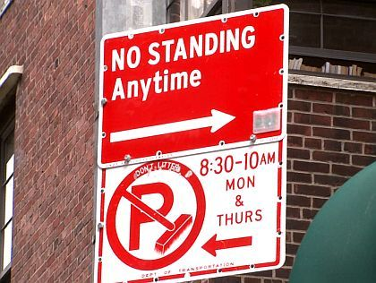
</p>

## Introduction
Parking violations are a major source of frustration when traveling or living within any city--especially New York. This project will focus on the top 5 violations issued by the NYPD and visualize where they occurred. It will also examine if the day of the week has an affect of the number of tickets issued.

----

## Data

The NYC Parking Violations [dataset](https://data.cityofnewyork.us/City-Government/Parking-Violations-Issued-Fiscal-Year-2019/faiq-9dfq) contains information about violations issued in fiscal year 2019. The original data had approximately 11 million observations. To narrow down my analysis, I decided to focus on the 5 most common types of violations:

1. No Parking-Street Cleaning
2. Fail To Display Municiple Meter Receipt
3. No Standing-Day/Time Limits
4. No Parking-Day/Time Limits
5. Double Parking

The dataset was reduced further by dropping columns that had greater than 50% missing values plus a few additional fields that were not needed. Rows with null values where then dropped and a random sample of 1% without replacement was chosen resulting in a dataset with 51,819 observations.

Open Street Map API via GeoPy was used to get the coordinate data for ~37,000 addresses. The cached results were read into pandas and merged with the sample dataset.

The attributes that were focused on are:

* Issued Date
* Violation Time
* Violation Code
* Violation Description
* Violation County
* Latitude
* Longitude

----

## Packages
1. PySpark
2. Pandas
3. NumPy
4. SciPy
5. Matplotlib
6. Folium
7. GeoPy

----

## Open Street Maps Nominatim API

A large amount of time was spent actually getting the coordinate data to create the map. I used the Nominatim class in GeoPy to do this. Nominatim is Open Street Maps (OSM) API, but GeoPy includes other mapping API as well (Google Maps, Bing, etc.). I decided to go with OSM because it's free and does not require an API key. The usage policy for using Nominatim can be found [here](https://operations.osmfoundation.org/policies/nominatim/). It includes the following restrictions for bulk geocoding:

* limit your requests to a single thread
* limited to 1 machine only, no distributed scripts (including multiple Amazon EC2 instances or similar)
* Results must be cached on your side. Clients sending repeatedly the same query may be classified as faulty and blocked.

To get all 37,000 addresses, it took approximately 17 hours. As you can see in the code below, it helps to run the function in chunks and append the data to a csv file as you go.

```python
park_sample['Address'] = park_sample['House Number'] + ' ' + park_sample['Street Name'] + ' NYC'

unique_addr = park_sample[['Address']].drop_duplicates()

def get_location(address):
    geolocator = Nominatim(user_agent="capstone1")
    location = geolocator.geocode(address)
    if location:
        lat, long = location.latitude, location.longitude
        return lat, long
    else:
        return 0, 0

for i in range(0, unique_addr.shape[0]+1, 100): 
    unique_addr['location'] = unique_addr.iloc[i:i+100, 0].apply(lambda x: get_location(x))
    unique_addr.iloc[i:i+100,:].to_csv('../data/address3.csv', mode='a', header=False)
    print(f"Another hundred done!!!!! {i} to {i + 100}")
```

----

## Visualizing the Data

### Mapping

Two maps were created to view the data: one without any layers and one that can be filtered by violation description

This first map displays clusters colored by how many violation occurred within the bounds of the cluster. To see the bounds of each particular cluster, simply hover over it and the area will be highlighted as shown below. As you can see from the map, if you plan on going to New York soon (and by "soon" I mean "after COVID"), it might be better to drive into Staten Island and take the ferry into the city.

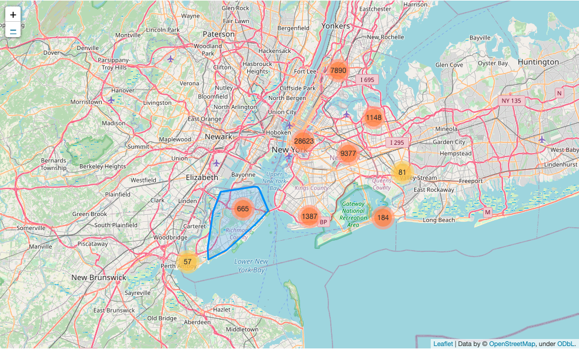

The second map can be filtered by violation description. The image below displays all 5 violations across New York. As one might imagine, Manhatten had the highest amount of parking tickets.

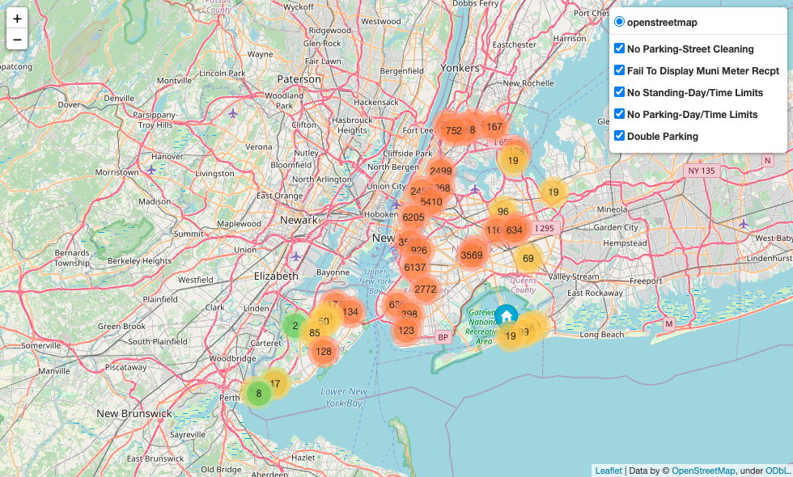

When we select only the No Parking-Street Cleaning tickets, we can see that Brooklyn and Queens actually has higher amounts of street cleaning tickets than Manhatten.

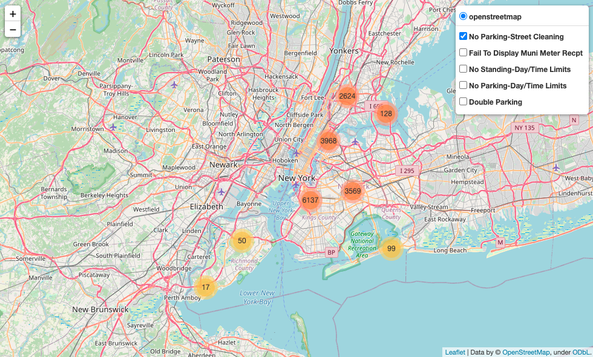

### Plotting
It can be assumed that time of day and day of week also effect the number of violations that occur--especially since no parking zones and street cleaning tend to only happen on certain days and during timeframes. We'll try to visualize that next.

As you can see in the plot below of the violation frequency by hours, violations start to spike around 7 AM until 5 PM. Street cleaniing violations have two extremely unusual spikes at 8-9 AM and 11 AM. This could be because different areas of New York have different street cleaning hours.

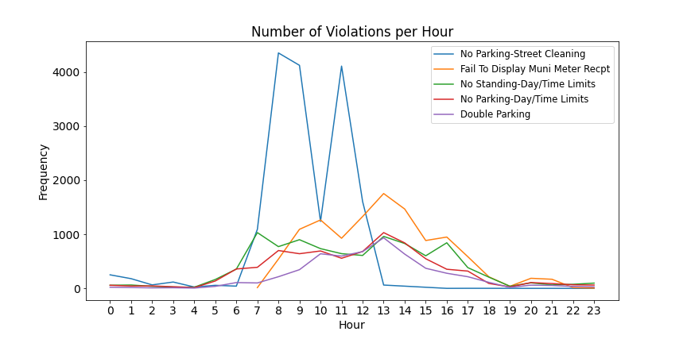

When viewing the same plot broken out by burough, it's clear that Brooklyn is driving the high street cleaning tickets with Queens having the next highest around 8 AM.

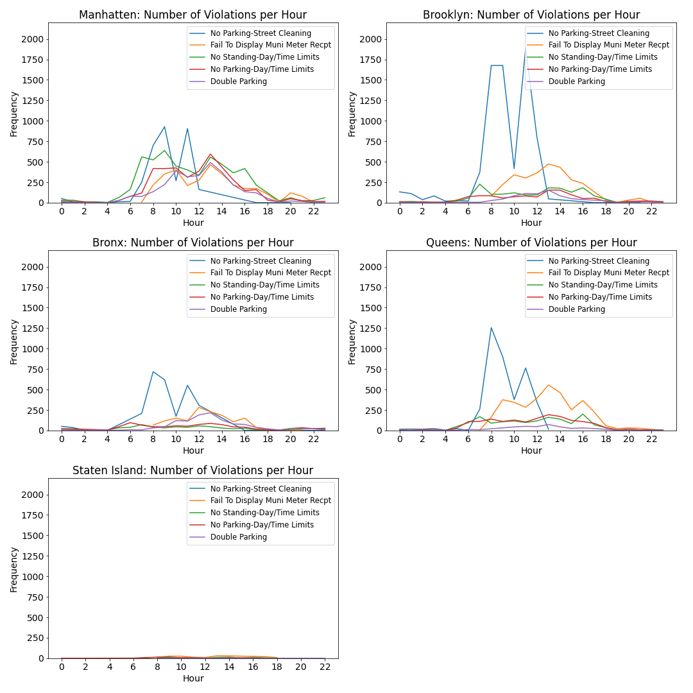

After some research, I found that the No Parking-Street Cleaning signs in Brooklyn are not always clear. According to [this article](https://northbrooklynnews.com/2020/08/10/street-cleaning-back-and-cleaning-up-on-tickets/) it got even more confusing this past summer. If the signs showed more than one day, street cleaning only occured on the last day from June 29 until Labor Day due to COVID. It would be interesting to repeat this study on the Fiscal Year 2020 data and compare to see if the number of tickets increased even more in those months.

<p align="center">
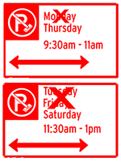
</p>


Next, we'll see if the day of the week impacted ticketing. As expected, the street cleaning tickets are higher on certain days due to different streets having different cleaning schedules. I was surprised to see that tickets issued for not displaying a meter receipt increased on Saturday. This could be due to drivers making an assumption that ticketing is more lax on a Saturday since it's not during the work week or due to tourists coming into the city on the weekends and not checking the parking restrictions. Sunday has fewer amounts of tickets across all violations which is to be expected.

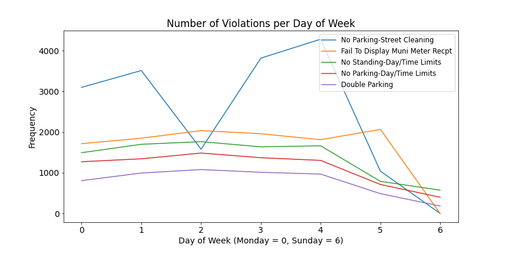

Again we'll view this data broken out by burough. It seems the spike in meter receipt tickets is mostly caused by Manhatten.

Once again, Staten Island has dramatically fewer tickets than the other buroughs. Those ferry boats are looking pretty good right now!

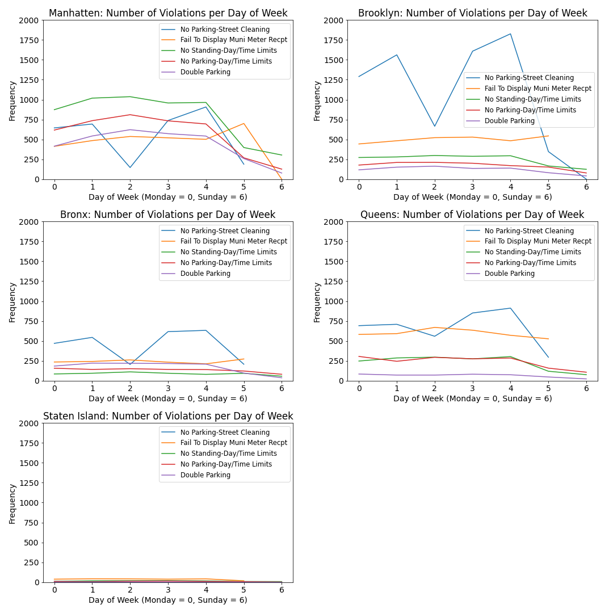

----

## Hypothesis Testing: Mann-Whitney U

Next we'll test to see if there are differences in the mean counts of violations based on the day of the week. I started by plotting the distribution for each day along with the mean for each distribution. As you can see in the plot, Monday through Friday have gaps in their distributions--each with clusters between about 0-20. This could be due to the different types of violations having different distributions. Sunday is the only day with a clear normal distribution. Since majority of the groups do not follow a normal distribution, we will use Mann-Whitney U to test for the differences.

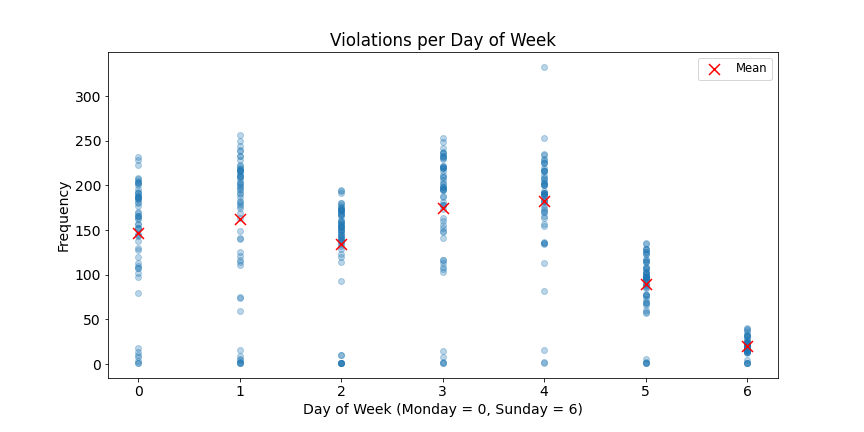

<p align="center">
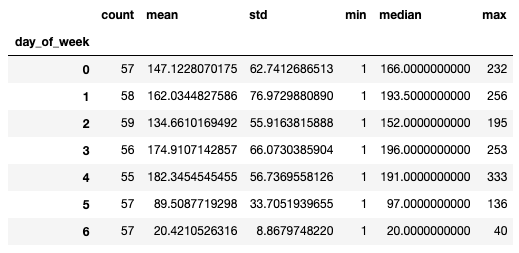
</p>

The empirical distributions for Tuesday, Thursday, and Friday all appear more similar to each other than to the distributions of the other weekdays. We will be testing for a difference between each combination, but I will be more focused on differences between Monday through Friday than the weekends.
<p align="center">
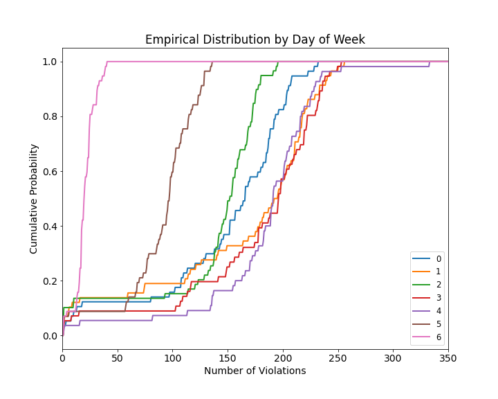
</p>

**Hypotheses**\
H<sub>0</sub>: the mean of group A = the mean of group B\
H<sub>A</sub>: the mean of group A is not equal to the mean of group B\

**Significance Level**\
alpha = 0.05

**Observations**
* Index 7, 8, & 15: Accept H<sub>0</sub> -  Due to the high p-values on these 3 tests, we can conclude that the difference in means of Tuesday, Thursday, and Friday is likely to be explained by the null hypothesis.

* Index 1: Reject H<sub>0</sub> - There is only a 4.2% chance that the difference in means of Monday and Wednesday can be explained by the null hypothesis. The difference in parking violations between these two days is statistically significant. Please note that the p-value in this test is very close to the alpha value. If we wanted a wider confidence interval this test would have gone the other way.

* The other tests: Reject H<sub>0</sub>

* Looking more closely at Index 1 and 8: The groups in Index 8 have a higher difference in mean than the groups in Index 1, yet we accepted the null hypothesis in 8 but rejected it in 1. This is most likely due to the larger difference in variance between the Index 8 group. One of the assumptions of Mann-Whitney U is that the groups have the same shape. As you can see in the empirical distributions, not all groups follow the same shape.

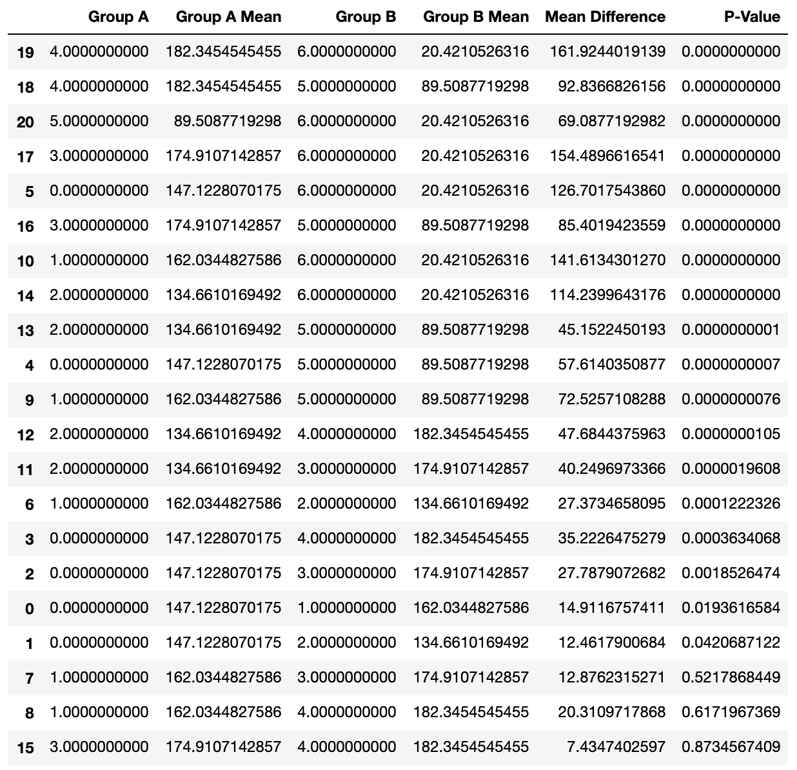

____

## Next Steps

* Try bootstrapping method and retest.
* Run linear regression analysis on frequency of tickets when the data is grouped by hour, weekday/weekend, week of month, etc.
* Rerun analysis for the fiscal year 2020 data.