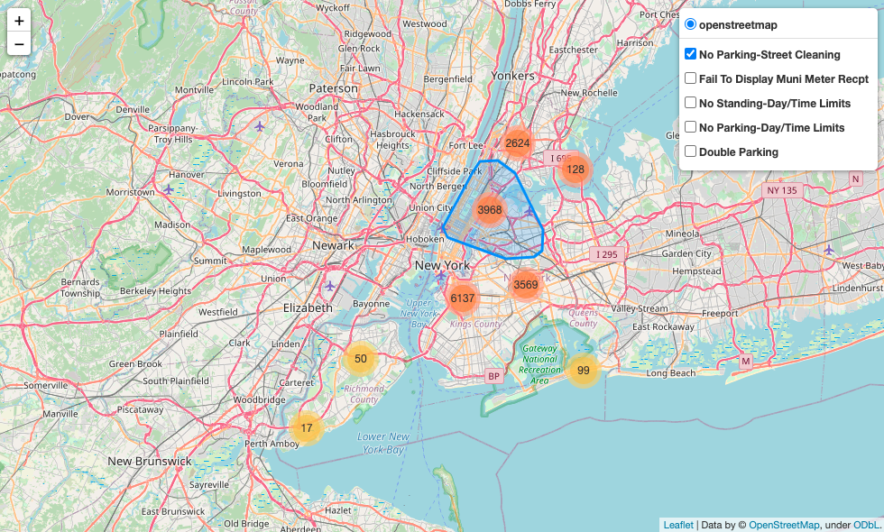
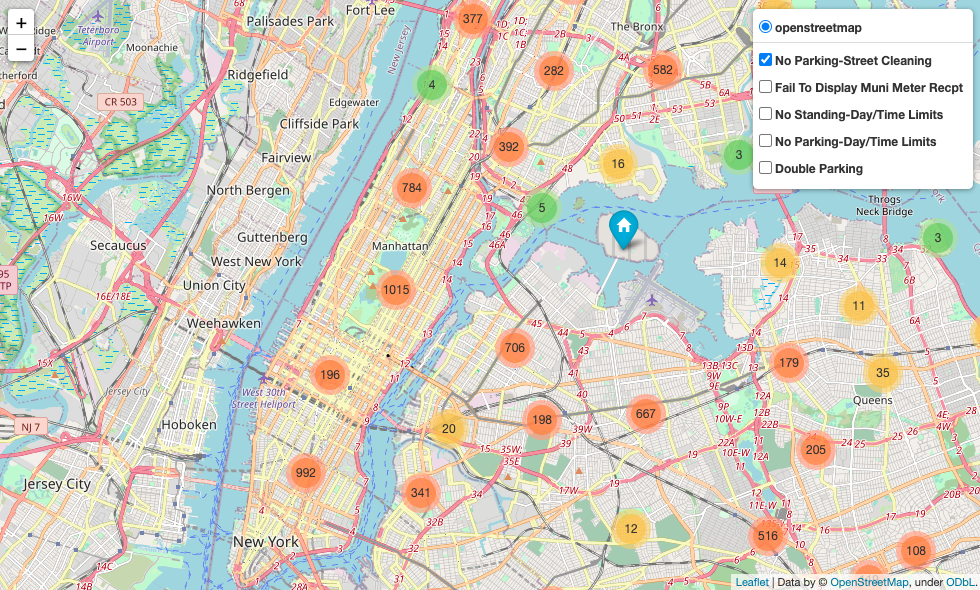

# Capstone 1: NYC Parking Violations

## Introduction
Parking violations are a major source of frustration when traveling or living within any city--especially New York. This project will focus on the top 5 violations issued by the NYPD and vizualize where they occured. It will also examine if the day of the week has an affect of the number of tickets issued and if there is a certain car make that gets ticketed more often.

## Data
The NYC Parking Violations dataset contains information about violations issued in fiscal year 2019. The original data had approximately 11 million observations. To narrow down my analysis, I decided to focus on the 5 most common types of violations:

1. No Parking-Street Cleaning
2. Fail To Display Municiple Meter Receipt
3. No Standing-Day/Time Limits
4. No Parking-Day/Time Limits
5. Double Parking

The dataset was reduced further by dropping columns that had greater than 50% missing values plus a few additional fields that were not needed. Rows with null values where then dropped and a random sample of 1% without replacement was chosen resulting in a dataset with 51,819 observations.

Open Street Map API was used to get the coordinate data for the addresses and the cached results were read in and merged with the sample dataset.

The attributes that were focused on are:

* Issued Date
* Violation Time
* Violation Code
* Violation Description
* Violation County
* Vehicle Make
* Latitude
* Longitude

## Packages
1. PySpark
2. Pandas
3. NumPy
4. SciPy
5. Matplotlib
6. Folium
7. GeoPy

## Visualizing the Data
A map was created to display clusters colored by size and can be filtered by violation description. The map in the image below displays all 5 violations across New York. If you plan on going to New York soon (and by "soon" I mean "after COVID"), it might be better to drive into Staten Island and take the ferry into the city. As one might imagine, Manhatten had the highest amount of parking tickets.

